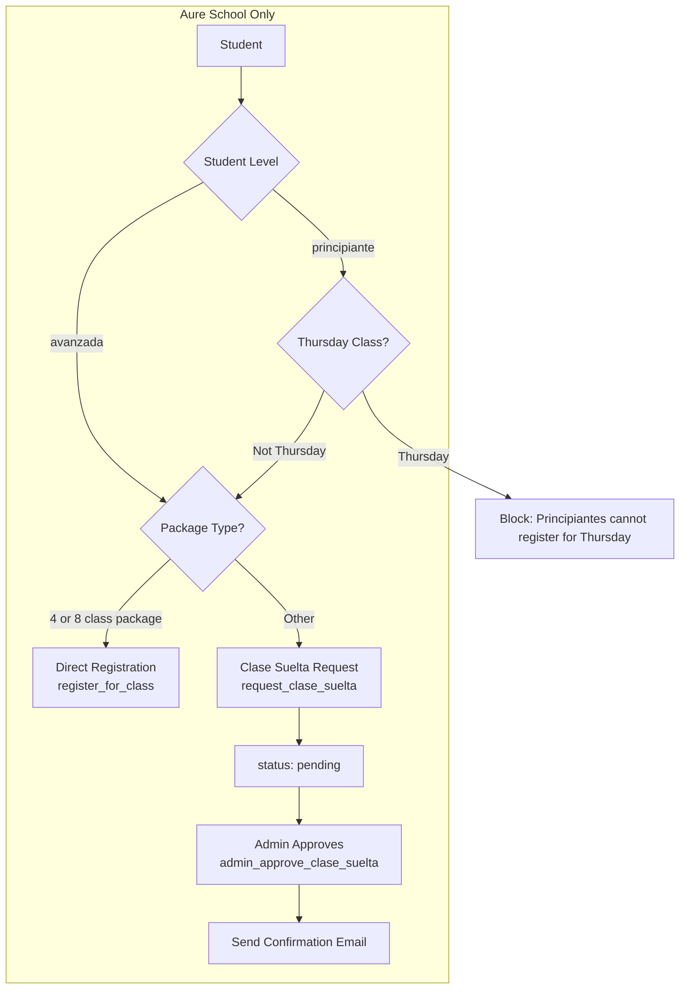

# Aure School Custom Registration — Detailed Implementation Plan

**Scope:** Aure school only. All changes must be gated by `school_id = AURE_SCHOOL_ID` or equivalent. No impact on other schools.

---

## 1. Requirements Summary


| Requirement                    | Behavior                                                                                         |
| ------------------------------ | ------------------------------------------------------------------------------------------------ |
| **Student level**              | Aure students can be set to `principiante` or `avanzada`                                         |
| **Avanzada**                   | Can register for all classes including Thursdays                                                 |
| **Principiante**               | Can register for all classes **except** Thursday classes                                         |
| **Package-based registration** | Only students with 4-class OR 8-class packages register directly                                 |
| **Non-4/8 students**           | Sign up as "clase suelta" → status `pending` → admin approves in dashboard → status `registered` |
| **Confirmation email**         | When admin approves a clase suelta, the student receives a confirmation email                    |


---

## 2. Architecture Overview




---

## 3. Database Changes

### 3.1 Students table: add `level` column (Aure-only semantics)

```sql
-- Migration: 20260228130000_aure_student_level.sql
ALTER TABLE public.students
  ADD COLUMN IF NOT EXISTS level text DEFAULT NULL
  CHECK (level IS NULL OR level IN ('principiante', 'avanzada'));

COMMENT ON COLUMN public.students.level IS 'Aure: principiante (no Thursday) or avanzada (all classes). NULL = default behavior.';
```

- **Gating:** The column exists for all schools but is only used when `school_id = AURE_SCHOOL_ID`. Non-Aure schools ignore it.
- **Admin UI:** Aure admin dashboard must allow editing student level (principiante / avanzada).
- **Default:** NULL or 'principiante' — recommend NULL so existing Aure students are not blocked until admin sets them.

### 3.2 Class registrations: add `pending` status

```sql
-- Migration: same file or follow-up
-- 1) Drop existing CHECK constraint on status
ALTER TABLE public.class_registrations
  DROP CONSTRAINT IF EXISTS class_registrations_status_check;

-- 2) Add new constraint including 'pending'
ALTER TABLE public.class_registrations
  ADD CONSTRAINT class_registrations_status_check
  CHECK (status IN ('registered','cancelled','attended','no_show','pending'));

COMMENT ON COLUMN public.class_registrations.status IS 'registered=confirmed; pending=awaiting approval (Aure clase suelta); cancelled; attended; no_show.';
```

- **Backward compatibility:** New status value; existing rows unchanged. All RPCs that filter by `status = 'registered'` must decide whether to include `pending` (e.g. capacity check: exclude pending; student "my registrations": show pending with different label).

### 3.3 Active packs: store `plan_limit` for package-type detection

To know if a student has a 4 or 8 class package, we need the original plan size when the pack was created.

```sql
-- Migration: 20260228131000_active_packs_plan_limit.sql
-- Extend activate_package_for_student to store plan_limit in each pack
```

**Change in `activate_package_for_student`:** when creating `v_new_pack`, add:

```json
"plan_limit": v_limit_group   -- the subscription's limit_count at activation time
```

- For unlimited packs: `plan_limit` = NULL or 0.
- For Aure: `has_direct_registration_package` = exists non-expired pack where `plan_limit IN (4, 8)`.

This requires modifying the `activate_package_for_student` function. **Backward compatibility:** existing packs without `plan_limit` are treated as "unknown" — for Aure, if no pack has plan_limit 4 or 8, student goes to clase suelta flow.

---

## 4. Helper: `is_aure_school`

Add a small SQL helper for consistent gating:

```sql
-- In a migration
CREATE OR REPLACE FUNCTION public.is_aure_school(p_school_id uuid)
RETURNS boolean
LANGUAGE sql
STABLE
SECURITY DEFINER
SET search_path = public
AS $$
  SELECT p_school_id = '38e570f9-5ca0-435e-8e99-70ebb5ae3b64'::uuid;
$$;
```

Use `AURE_SCHOOL_ID` from `src/config.js` — ensure the UUID matches.

---

## 5. New RPCs

### 5.1 `request_clase_suelta` (Aure only)

For students without 4/8 package who want to attend a class. Creates a registration with `status = 'pending'`.

**Signature:**

```sql
request_clase_suelta(
  p_student_id text,
  p_class_id bigint,
  p_school_id uuid,
  p_class_date date
)
RETURNS jsonb
```

**Logic:**

1. **Gate:** If NOT `is_aure_school(p_school_id)`, RAISE EXCEPTION 'This flow is only available for Aure school.'
2. Validate class and student.
3. Check student has `paid = true` (some active membership).
4. **Level check:** If `student.level = 'principiante'` and class `day = 'Thu'`, RAISE EXCEPTION 'Principiantes cannot register for Thursday classes.'
5. **Capacity:** Count only `status IN ('registered','pending')` for capacity. If full, RAISE EXCEPTION.
6. If existing row (same class/student/date): if status = 'pending', return it; if status = 'registered', RAISE 'Already registered'; if cancelled, allow new request.
7. INSERT with `status = 'pending'`.
8. Return the row as jsonb.

### 5.2 `admin_approve_clase_suelta` (Aure only)

Admin approves a pending clase suelta. Changes status to `registered` and triggers confirmation email.

**Signature:**

```sql
admin_approve_clase_suelta(p_registration_id uuid)
RETURNS void
```

**Logic:**

1. Select registration; if not found or status != 'pending', RAISE.
2. If NOT `is_aure_school(registration.school_id)`, RAISE.
3. If NOT `is_school_admin(registration.school_id)` AND NOT `is_platform_admin()`, RAISE.
4. UPDATE status to 'registered'.
5. **Email:** Use a Supabase Edge Function or pg_net to call `send_clase_suelta_confirmation` with registration_id. (See §8.)

### 5.3 `admin_reject_clase_suelta` (Aure only)

Admin rejects a pending clase suelta. Sets status to 'cancelled'.

**Signature:**

```sql
admin_reject_clase_suelta(p_registration_id uuid)
RETURNS void
```

Reuse logic similar to `admin_cancel_class_registration` but only for status = 'pending'.

**Note:** Migration `20260229000000_revert_aure_package_slots.sql` dropped `admin_cancel_class_registration`. We can re-add it for Aure (or use a generic admin cancel) if needed for other flows. For this plan, `admin_reject_clase_suelta` suffices for rejections.

### 5.4 `student_update_level` (Aure only)

Admin updates a student's level (principiante / avanzada) from the Alumnos → Nivel subtab.

**Signature:**

```sql
student_update_level(
  p_student_id text,
  p_school_id uuid,
  p_level text  -- 'principiante', 'avanzada', or NULL
)
RETURNS void
```

**Logic:**

1. If NOT `is_aure_school(p_school_id)`, RAISE EXCEPTION.
2. If NOT `is_school_admin(p_school_id)` AND NOT `is_platform_admin()`, RAISE EXCEPTION.
3. Validate student exists and belongs to school.
4. If `p_level` is not NULL and not in ('principiante','avanzada'), RAISE EXCEPTION.
5. UPDATE students SET level = p_level WHERE id = p_student_id AND school_id = p_school_id.

---

## 6. Modify Existing RPCs (Aure Gating)

### 6.1 `register_for_class`

**Current behavior:** Validates student, balance, capacity; inserts/updates with status 'registered'.

**Aure-specific logic (only when `is_aure_school(p_school_id)`):**

1. **Level check:** If `student.level = 'principiante'`:
  - Get class: `SELECT day FROM classes WHERE id = p_class_id`
  - If `day = 'Thu'` (Thursday), RAISE EXCEPTION 'Principiantes cannot register for Thursday classes. Please request as clase suelta or contact the school.'
2. **Package check:** If student does NOT have a 4 or 8 class package:
  - RAISE EXCEPTION 'To register directly, you need a 4 or 8 class package. Please use "Request clase suelta" for this class.'
  - (Alternatively: automatically redirect to `request_clase_suelta` — but that would change the RPC contract. Cleaner: frontend calls different RPC based on package type.)

**Implementation:** Add a block at the start (after basic validation):

```sql
IF public.is_aure_school(p_school_id) THEN
  -- Level: principiante cannot register for Thursday
  IF COALESCE(v_student.level, '') = 'principiante' THEN
    IF v_class.day = 'Thu' THEN
      RAISE EXCEPTION 'Principiantes cannot register for Thursday classes.';
    END IF;
  END IF;
  -- Package: must have 4 or 8 class package for direct registration
  IF NOT (/* student has pack with plan_limit IN (4,8) */) THEN
    RAISE EXCEPTION 'Direct registration requires a 4 or 8 class package. Use "Request clase suelta" instead.';
  END IF;
END IF;
```

**Helper to implement "has 4 or 8 class package":**

```sql
-- In register_for_class or as a small helper
SELECT 1 FROM jsonb_array_elements(COALESCE(v_student.active_packs, '[]'::jsonb)) AS elem
WHERE ((elem->>'expires_at')::timestamptz IS NULL OR (elem->>'expires_at')::timestamptz > now())
  AND (elem->>'plan_limit')::int IN (4, 8)
LIMIT 1;
```

If no such row, student does not have 4/8 package.

### 6.2 `register_for_class_monthly`

Same Aure gating as `register_for_class`:

- For each date, the class is the same so `day` is fixed.
- If principiante and day = 'Thu', block the entire monthly registration.
- If no 4/8 package, block monthly direct registration (they would need to request clase suelta per class — monthly might not apply to clase suelta; confirm with Aure).

**Recommendation:** For Aure, if student lacks 4/8 package, do not offer monthly registration at all for that class. The modal can show: "Monthly registration is only available with a 4 or 8 class package."

---

## 7. RPCs: Include `pending` Where Appropriate


| RPC                                   | Include pending?                                         |
| ------------------------------------- | -------------------------------------------------------- |
| `get_class_availability`              | Count `pending` in `registered_count` (they hold a spot) |
| `get_student_upcoming_registrations`  | Yes — student should see "Pending approval"              |
| `get_student_past_registrations`      | Yes                                                      |
| `get_class_registrations_for_date`    | Yes — admin sees pending with clear label                |
| `get_student_registrations_for_today` | Only `registered` (QR scanner — pending cannot check in) |
| `process_expired_registrations`       | No — only process `registered`, not `pending`            |
| `mark_registration_attended`          | Only `registered`                                        |


---

## 8. Email: Clase Suelta Confirmation

### 8.1 Edge Function: `send_clase_suelta_confirmation`

**New file:** `supabase/functions/send_clase_suelta_confirmation/index.ts`

**Invocation:** 

- Option A: Called by `admin_approve_clase_suelta` via `pg_net` / HTTP request from DB.
- Option B (simpler): Called by frontend after admin clicks Approve — frontend calls `admin_approve_clase_suelta`, then calls this Edge Function with the registration_id.

**Recommended:** Option B to avoid DB-triggered HTTP. Admin approval flow:

1. Frontend calls `admin_approve_clase_suelta(registration_id)`.
2. On success, frontend calls Edge Function `send_clase_suelta_confirmation` with `{ registration_id }`.
3. Edge Function fetches registration + class + student (email from student or profile), sends email via Resend.

**Edge Function logic:**

- Input: `{ registration_id: uuid }` (from POST body).
- Load registration, class, student, get student email (from `students.email` or `profiles.email` via `students.user_id`).
- Send HTML email: "Your clase suelta for [Class Name] on [Date] at [Time] has been approved. You are registered!"
- Use Resend API (same pattern as `send_verification_email`).

---

## 9. Frontend Changes

### 9.1 Aure Admin Dashboard — Alumnos Tab with Level Subtab

**Location:** Admin → Alumnos (students) tab. For Aure school only (`state.currentSchool?.id === AURE_SCHOOL_ID`).

Add **subtabs** within the Alumnos tab:


| Subtab    | Label (es)   | Purpose                                                             |
| --------- | ------------ | ------------------------------------------------------------------- |
| **Lista** | Lista        | Default view — existing student list with filters and search        |
| **Nivel** | Nivel (Aure) | Aure only — set student level (principiante / avanzada) per student |


**Implementation:**

1. **Tab bar:** Below the Alumnos header, render two tabs: "Lista" and "Nivel". Show "Nivel" only when `state.currentSchool?.id === AURE_SCHOOL_ID`.
2. **State:** `state.adminStudentsSubtab = 'lista' | 'nivel'` (default `'lista'`).
3. **Nivel subtab content:**
  - Same student list as Lista (or a simplified list), but each student card/row includes:
    - Student name, email, pack info (as today)
    - **Level dropdown:** Principiante | Avanzada | (sin asignar / Not set)
  - On change: call RPC `student_update_level(p_student_id, p_school_id, p_level)` → updates `students.level`.
  - Optional: filter by level (Principiante / Avanzada / Sin asignar) to quickly find students needing assignment.
4. **Lista subtab:** Unchanged — current student list with all existing filters (pack, package, payment, search).

**RPC for level update:** Add `student_update_level(p_student_id text, p_school_id uuid, p_level text)` — only when `is_aure_school(p_school_id)`, and caller must be school admin or platform admin. Updates `students SET level = p_level` where `level` is in (`'principiante'`, `'avanzada'`, `NULL`).

**i18n keys:** `aure_level_subtab`, `aure_level_principiante`, `aure_level_avanzada`, `aure_level_not_set`, `aure_level_label`.

---

### 9.2 Aure Admin — Class Registrations View

- **Class registrations view:** When viewing registrations for a date:
  - Show pending registrations with a "Pending" badge.
  - Add "Approve" and "Reject" buttons for pending rows.
  - Approve → `admin_approve_clase_suelta` + `send_clase_suelta_confirmation`.
  - Reject → `admin_reject_clase_suelta`.

### 9.2 Student Schedule / Registration UI (Aure only)

- **Register button logic:**
  1. If principiante and class.day === 'Thu': disable button, show tooltip "Principiantes cannot register for Thursday classes."
  2. If student has 4 or 8 class package: show "Register" → call `register_for_class` / `register_for_class_monthly` as today.
  3. If student does NOT have 4 or 8 package: show "Request clase suelta" → call `request_clase_suelta`.
- **Monthly registration:** Only show if student has 4/8 package (for Aure).

### 9.4 Student My Registrations Page (Registros)

**Location:** Student view → QR / My Classes section → "Class Registrations" / "Registros de clases" expandable block. Data from `get_student_upcoming_registrations` and `get_student_past_registrations`.

**Behavior:**

- Include **pending** classes in both upcoming and past sections. The RPCs `get_student_upcoming_registrations` and `get_student_past_registrations` already return `pending` (see §4 migration).
- **Upcoming registrations:** Show both `registered` and `pending`. For `pending`, display a badge/label (e.g. "Pending approval") and distinct styling (e.g. amber/orange badge).
- **Past registrations:** Include `pending` if any (e.g. a clase suelta request for a past date that was never approved/rejected).
- **Display order:** Registered first, then pending; or group by status with "Upcoming" / "Pending approval" subsections.
- **No cancel** for pending from student side (or offer "Withdraw request" that cancels the pending registration).

**Frontend change:** Update the filter from `r.status === 'registered'` to `r.status === 'registered' || r.status === 'pending'` for the upcoming list. Render pending items with the translated "Pending approval" label.

### 9.5 Determining "has 4 or 8 class package" on frontend

Options:

- **A)** Add RPC `get_student_registration_eligibility(p_student_id, p_school_id)` returning `{ can_register_directly: boolean, level: 'principiante'|'avanzada', ... }`.
- **B)** Frontend already has `state.currentUser` with `active_packs`. Check clientside: any pack with `plan_limit` in (4, 8) and not expired.

Recommendation: **A** — single source of truth in DB, no need to expose full pack structure. RPC returns:

```json
{
  "level": "principiante" | "avanzada" | null,
  "has_direct_registration_package": true | false,
  "can_register_for_day": { "Mon": true, "Tue": true, ..., "Thu": false, ... }  // for principiante
}
```

Optional: `can_register_for_day` only needed for principiante; for avanzada all true. Simplify: `can_register_thursday: boolean`.

---

## 10. i18n — All New Texts in All Languages

All new user-facing strings must be added to **en**, **es**, and **de** in `src/legacy.js` (and reflected in `app.js` after build). Use the existing `t()` / `window.t()` pattern.

**Keys to add:**


| Key                                | en                                                                                       | es                                                                                                 | de                                                                                                  |
| ---------------------------------- | ---------------------------------------------------------------------------------------- | -------------------------------------------------------------------------------------------------- | --------------------------------------------------------------------------------------------------- |
| `registration_status_pending`      | Pending approval                                                                         | Pendiente de aprobación                                                                            | Warten auf Genehmigung                                                                              |
| `registration_status_registered`   | Registered                                                                               | Registrado                                                                                         | Angemeldet                                                                                          |
| `clase_suelta_request`             | Request clase suelta                                                                     | Solicitar clase suelta                                                                             | Clase suelta anfragen                                                                               |
| `aure_level_subtab`                | Level                                                                                    | Nivel                                                                                              | Niveau                                                                                              |
| `aure_level_principiante`          | Principiante                                                                             | Principiante                                                                                       | Anfänger                                                                                            |
| `aure_level_avanzada`              | Avanzada                                                                                 | Avanzada                                                                                           | Fortgeschritten                                                                                     |
| `aure_level_not_set`               | Not set                                                                                  | Sin asignar                                                                                        | Nicht gesetzt                                                                                       |
| `aure_level_label`                 | Level                                                                                    | Nivel                                                                                              | Niveau                                                                                              |
| `aure_principiantes_no_thursday`   | Principiantes cannot register for Thursday classes.                                      | Los principiantes no pueden registrarse en clases de jueves.                                       | Anfänger können sich nicht für Donnerstagskurse anmelden.                                           |
| `aure_need_4_8_package`            | Direct registration requires a 4 or 8 class package. Use "Request clase suelta" instead. | El registro directo requiere un paquete de 4 u 8 clases. Usa "Solicitar clase suelta" en su lugar. | Direkte Anmeldung erfordert ein 4- oder 8-Stunden-Paket. Nutze stattdessen „Clase suelta anfragen“. |
| `aure_monthly_4_8_only`            | Monthly registration is only available with a 4 or 8 class package.                      | El registro mensual solo está disponible con un paquete de 4 u 8 clases.                           | Monatliche Anmeldung ist nur mit einem 4- oder 8-Stunden-Paket möglich.                             |
| `aure_approve`                     | Approve                                                                                  | Aprobar                                                                                            | Genehmigen                                                                                          |
| `aure_reject`                      | Reject                                                                                   | Rechazar                                                                                           | Ablehnen                                                                                            |
| `aure_pending_badge`               | Pending                                                                                  | Pendiente                                                                                          | Ausstehend                                                                                          |
| `my_registrations_pending_section` | Pending approval                                                                         | Pendientes de aprobación                                                                           | Warten auf Genehmigung                                                                              |
| `withdraw_request`                 | Withdraw request                                                                         | Retirar solicitud                                                                                  | Anfrage zurückziehen                                                                                |


**Existing keys** that may need context or reuse: `my_registrations_label`, `upcoming_classes`, `past_classes`.

---

## 11. Migration Order and Safety


| Order | Migration                                           | Purpose                                                                                                                                                               |
| ----- | --------------------------------------------------- | --------------------------------------------------------------------------------------------------------------------------------------------------------------------- |
| 1     | `20260228130000_aure_student_level.sql`             | Add `students.level`, `is_aure_school`, `pending` status                                                                                                              |
| 2     | `20260228131000_active_packs_plan_limit.sql`        | Store `plan_limit` in new packs; backfill if feasible                                                                                                                 |
| 3     | `20260228132000_aure_register_and_clase_suelta.sql` | `request_clase_suelta`, `admin_approve_clase_suelta`, `admin_reject_clase_suelta`, `student_update_level`, modify `register_for_class` / `register_for_class_monthly` |
| 4     | `20260228133000_aure_registration_rpcs_pending.sql` | Update `get_class_availability`, `get_class_registrations_for_date`, `get_student_upcoming_registrations` to handle `pending`                                         |


**Live safety:** 

- All new logic is behind `is_aure_school()`. 
- No changes to `register_for_class` signature. 
- `pending` is additive; existing rows remain `registered`/`cancelled`/etc.
- No function overloads; we only add parameters with DEFAULT when extending.

---

## 11. File Change Summary


| Layer             | Files                                                                                                                        |
| ----------------- | ---------------------------------------------------------------------------------------------------------------------------- |
| **DB migrations** | `supabase/migrations/20260228130000_*.sql`, `20260228131000_*.sql`, `20260228132000_*.sql`, `20260228133000_*.sql`           |
| **Edge function** | `supabase/functions/send_clase_suelta_confirmation/index.ts`                                                                 |
| **Frontend**      | `app.js`, `src/legacy.js` — Aure-gated UI for level, approve/reject, request clase suelta, show pending in student registros |
| **i18n**          | `src/legacy.js` — all new keys in en, es, de (see §10)                                                                       |
| **Config**        | `src/config.js` already has `AURE_SCHOOL_ID`                                                                                 |


---

## 13. Student Level Default and Backfill

- **Default for new Aure students:** `level = NULL`. When NULL, treat as Principiante for safety (block Thursday) until admin sets them. Or treat NULL as "not set" and allow all classes until set — product decision.
- **Recommendation:** NULL = principiante (conservative). Admin must set avanzada explicitly.
- **Backfill:** Migration can set `level = 'principiante'` for existing Aure students, or leave NULL.

---

## 14. Edge Cases

1. **Student changes level mid-day:** Use current level at registration time. No need to revalidate existing registrations.
2. **Student buys 4-class package after pending:** Pending stays; admin can still approve. Future registrations use direct flow.
3. **Thursday class full:** Both direct and clase suelta are blocked by capacity.
4. **Admin rejects:** Status → cancelled. No email. Student can request again if desired.

---

## 15. Testing Checklist

- Non-Aure school: no changes to registration flow.
- Aure principiante: cannot register for Thursday; can register for other days if 4/8 package.
- Aure principiante: can request clase suelta for non-Thursday.
- Aure avanzada: can register for Thursday if 4/8 package.
- Aure student without 4/8 package: "Request clase suelta" creates pending; admin approves → email sent.
- `get_class_registrations_for_date` shows pending with Approve/Reject.
- Capacity correctly counts pending.

