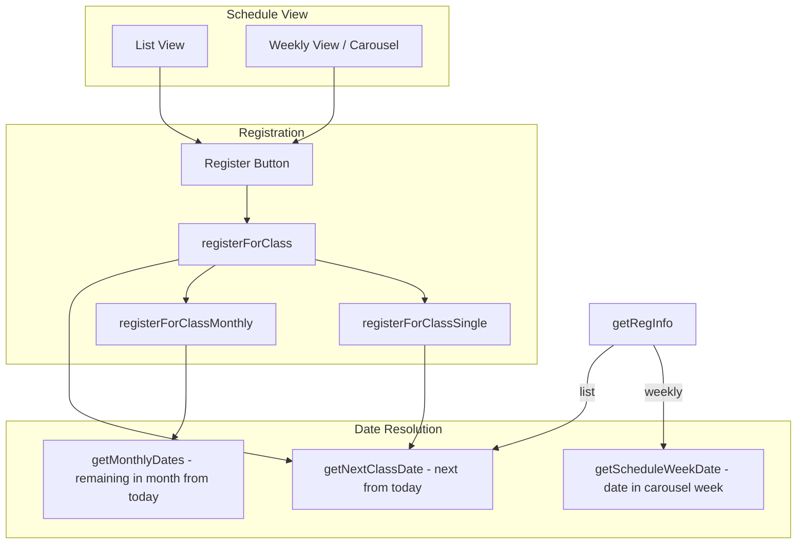

# Class Registration Flow Fix

## Problem Summary

1. **Wrong date on single registration**: When a student clicks "Register" on a class in the weekly carousel (e.g. Saturday of week 3), the system registers for `getNextClassDate(day)` = the next occurrence from today, not the specific date shown in that week's tile. Result: student thinks they registered for week 3's Saturday, but they're actually registered for week 1's Saturday. When they navigate forward, the class is not green (correct behavior given wrong data).
2. **Monthly modal logic**:
  - Last week of month: should not offer monthly option if only 1 class remains (partially handled via `monthlyDates.length > 1`, but `dayOfMonth > 14` blocks monthly entirely in second half of month).
  - Week 1: sign up for whole month; week 2: sign up for remaining 3 weeks. The `dayOfMonth > 14` restriction prevents week 2 sign-up for remaining weeks.
3. **Monthly "remaining" dates**: When in weekly view and the user clicks a tile in week 3, "this month" should mean "remaining from that tile's date onward", not necessarily from today.

---

## Current Architecture




**Bug**: `registerForClass`/`registerForClassSingle` always use `getNextClassDate`; the tile's `dayDate` from `getScheduleWeekDate` is only used for **display** (getRegInfo), not for the actual registration.

---

## Implementation Plan

### 1. Pass date from schedule to registration (fix wrong-date bug)

**Files**: [app.js](app.js), [src/legacy.js](src/legacy.js)

- **weekly view**: The `buildTileReg` function receives `info` from `getRegInfo(c, dayDate)`. Pass `dayDate` (or `dateStr`) to the Register button's `onclick`. Change:

```javascript
  onclick="... window.registerForClass(${c.id}, '...')"
  

```

  to:

```javascript
  onclick="... window.registerForClass(${c.id}, '...', '${dateStr}')"
  

```

  where `dateStr` comes from `info.dateStr` (already computed in getRegInfo from dayDate).

- **list view**: No date override; call `registerForClass(classId, className)` (2 args). The function will fall back to `getNextClassDate`.
- **registerForClass(classId, className, optionalDateStr)**:
  - Add third optional parameter `optionalDateStr`.
  - Resolve `targetDate`: if `optionalDateStr` provided, use it; else use `getNextClassDate(classObj.day)`.
  - Use `targetDate` for the "class already started" check and for passing to single/monthly flows.
- **registerForClassSingle(classId, className, optionalDateStr)**:
  - Add third optional parameter.
  - Use `optionalDateStr` when provided; otherwise `getNextClassDate(classObj.day)`.
  - Call `register_for_class` RPC with that specific date.
- **registerForClassMonthly(classId, className, optionalAnchorDateStr)**:
  - Add optional anchor for "remaining from this date". When provided, `getMonthlyDates(dayCode, anchorDate)` returns dates from that anchor onward in the month.
  - When called from the modal after user chose "monthly", pass the same date we would have used for single (the tile's date).

### 2. getMonthlyDates with optional anchor

**Files**: [app.js](app.js), [src/legacy.js](src/legacy.js)

- `window.getMonthlyDates(dayCode, anchorDate?)`:
  - **Current**: Returns all dates of `dayCode` in current month, from today onward.
  - **New**: If `anchorDate` (Date or ISO string) provided: use its year/month, return dates of that day in that month that are >= anchorDate. If not provided: keep current behavior (today as anchor).

### 3. isMonthlyRegistrationAvailable and monthly modal conditions

**Files**: [app.js](app.js), [src/legacy.js](src/legacy.js)

- **Remove `dayOfMonth > 14`** from `isMonthlyRegistrationAvailable()`. The check `monthlyDates.length > 1` already prevents showing the modal when only 1 class remains. The day-of-month cutoff was too strict (blocked week 2 from signing up for remaining 3 weeks).
- **Monthly modal in registerForClass**: When deciding to show the modal, use `getMonthlyDates(classObj.day, targetDate)` where `targetDate` is the date we're registering for (from tile or getNextClassDate). If that returns `length > 1`, show the modal. The modal text already uses `monthlyDates.length` for "Register for all {n} classes this month".
- **Single vs monthly choice**: When user picks "this class only", call `registerForClassSingle(classId, className, targetDateStr)`. When user picks "all this month", call `registerForClassMonthly(classId, className, targetDateStr)` which will use `getMonthlyDates(dayCode, targetDate)` to get the remaining dates from that anchor.

### 4. Success message clarity (optional)

To avoid confusion like "registered for all Saturdays", consider updating the single-registration success copy to be explicit, e.g. "Registered for [date]" in the modal or a new i18n key. This is a minor UX improvement; the main fix is using the correct date.

### 5. loadClassAvailability coverage

**Verification**: [app.js](app.js) lines 9744-9756 - `loadClassAvailability` already adds dates for the displayed week using `scheduleWeekOffset`. No change needed; registrations are fetched per-date and the carousel will show green for the correct weeks once we register for the correct dates.

---

## File Change Summary


| File                           | Changes                                                                                                                                                                                                                                                                                                                                                                                                                                                                |
| ------------------------------ | ---------------------------------------------------------------------------------------------------------------------------------------------------------------------------------------------------------------------------------------------------------------------------------------------------------------------------------------------------------------------------------------------------------------------------------------------------------------------- |
| [app.js](app.js)               | 1) `buildTileReg`: pass `info.dateStr` to `registerForClass` in weekly tile onclick. 2) `registerForClass`: add `optionalDateStr`, resolve targetDate, pass to single/monthly. 3) `registerForClassSingle`: add optional `dateStr`, use it when provided. 4) `registerForClassMonthly`: add optional anchor, call `getMonthlyDates` with anchor. 5) `getMonthlyDates`: add optional `anchorDate` param. 6) `isMonthlyRegistrationAvailable`: remove `dayOfMonth > 14`. |
| [src/legacy.js](src/legacy.js) | Mirror the same changes (this is the source before build; app.js may be bundled output).                                                                                                                                                                                                                                                                                                                                                                               |


No Supabase migrations required: `register_for_class` and `register_for_class_monthly` already accept a single date and a date array respectively. All changes are frontend.

---

## Backward Compatibility

- `registerForClass(classId, className)` with 2 args continues to work (list view, any caller not passing date).
- `registerForClassSingle` and `registerForClassMonthly` with 2 args: optional params default to current behavior.
- No API or RPC changes.

